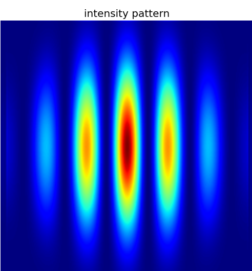

#Installation of LightPipes for Python on a Windows PC.
Tested on Windows 7, 8.1, and 10, on 64- and 32 bits machines.

##1. Installation of Python:
1.	[Download Python version 2 from: http://www.python.org/downloads/](http://www.python.org/downloads/) **Not version 3!**
2.	Execute: ‘python-2.x.x.msi’
3.	Choose default directory: ‘C:\Python27’
4.	Choose: ‘*Add Python.exe to Path*’ and restart the computer
5.	Test Python in command window(*cmd.exe*). Enter:

	**Python**

	The Python prompt (**>>>**) should appear. Type:

	**quit()**

	to leave it.

<<<<<<< HEAD
##2. Installation of Python packages:
=======
##1.2. Installation of Python packages:
>>>>>>> origin/master
1.	The installation of some packages requires a c++ compiler. [Download command line compiler VCForPython27](http://aka.ms/vcpython27)
2.	Execute ‘VCForPython27.msi’ to install the compiler
3.	Modify the Path: right-click ‘Start, Computer’, ‘Properties’, ‘Advanced system settings’, ‘Environment Variables…’. Add to the Path variable: ‘C:\Python27\;C:Python27\Lib\site-packages\;’ and restart the computer.
4.	[Download from: https://pypi.python.org/pypi/setuptools](https://pypi.python.org/pypi/setuptools) *ez\_setup.py* (Save the python script displayed by: [https://bootstrap.pypa.io/ez_setup.py](https://bootstrap.pypa.io/ez_setup.py) in a text- file called *ez\_setup.py*)
5.	Open command window (cmd.exe).  Type:
	
	**cd C:\Python27\Scripts**
6.	Type at the windows prompt:

	**python ez\_setup.py**

7.	Type at the windows prompt:
	
	**easy_install  pip**
	
	to install the python package installer *pip*.
8.	Check at the windows prompt the installed packages by typing:

	**pip list**

	The response should be like:

		pip(1.5.6)
		setuptools(7.0)
	For LightPipes you need the  ‘*Numpy*’ package. For graphics: the ‘*matplotlib*’ package.
9.	Install ‘Numpy’ by typing at the windows prompt:
	
	**pip install numpy** (takes a while…)

	The *VCForPython27* compiler needs the [*.NET Framework 3.5*](https://www.microsoft.com/en-us/download/details.aspx?id=21). A window should pop-up to invite you to install it. If it does not, you must install it by hand.
10.	Install *matplotlib* by typing at the windows prompt:

	**pip install matplotlib**
11.	Check the installed packages again: Type:

	**pip list**

	The response should be like:

		matplotlib(1.4.2)
		numpy(1.9.0)
		pip(1.5.6)
		pyparsing(2.0.3)
		python_dateutil(2.2)
		pytz(2014.7)
		setuptools(7.0)
		six(1.8.0)
12.	Your system is now ready for *LightPipes for Python*.

##3.	Install LightPipes for Python:
1.	To install LightPipes for Python, version 1.0.0., Open the windows command window and type (copy/paste) at the windows prompt:

	**easy\_install https://github.com/FredvanGoor/LightPipes-for-Python/raw/master/LightPipes-Packages/Windows-32-and-64-bits/LightPipes-1.0.0-py2.7-win32.egg**
	
	or, from the downloaded and extracted zip-file:

	**easy_install install\_directory\LightPipes-Packages\Windows-32-and-64-bits\LightPipes-1.0.0-py2.7-win32.egg**

	where install\_directory is the directory in which you put the zip-file.

2.	This will download the installation and installs LightPipes for Python.
3.	Check by typing:

	**pip list**

	The list should now contain:

		lightpipes (1.0.0).

	You could un-install LightPipes by typing:

	**pip uninstall LightPipes**

##4.	Installation of a very nice editor ‘Geany’:
1.	Geany is a very useful editor for editing program files including *Python* scripts.
2.	Download from: [http://www.geany.org/Download/Releases](http://www.geany.org/Download/Releases) geany-1.2.6setup.exe.
3.	Execute: geany-1.2.6setup.exe.
4.	Choose the default settings- and install directory.

##5.	Make your first LightPipes script file.
1.	Start *Geany*, open a new document and type (or copy/paste)  the following script:

		import LightPipes
		import matplotlib.pyplot as plt
		m=1
		nm=1e-9*m
		um=1e-6*m
		mm=1e-3*m
		cm=1e-2*m

		try:
			LP=LightPipes.Init()
		
			wavelength=20*um
			size=30.0*mm
			N=1000
			
			F=LP.Begin(size,wavelength,N)
			F1=LP.CircAperture(0.15*mm, 0, -0.6*mm, F)
			F2=LP.CircAperture(0.15*mm, 0, 0.6*mm, F)    
			F=LP.BeamMix(F1,F2)
			F=LP.Fresnel(10*cm,F)
			I=LP.Intensity(2,F)
			plt.imshow(I)
			plt.show()
			
		finally:
			del LightPipes

2.	Save the document as ‘Young.py’, and push in *Geany*  the execute button or open a terminal window and type at the prompt:

	**python Young.py**

3.	After a few seconds a window with the output appears:

###6. Explanation of the commands

		Import LightPipes  							imports the LightPipes library (from ‘LightPipes.pyd’)

		import matplotlib.pyplot as plt				imports matplotlib for the graphics
		LP=LightPipes.Init()						initiates LightPipes 
													(make a new instance of LightPipes called ‘LP’)
													for a grid-size, grid-dimension and wavelength defined by the Begin command.

		wavelength=20*um							Define the wavelength, grid-size and grid-dimension.
		size=30.0*mm
		N=1000

		F=LP.Begin(size,wavelength,N)				The simulation of Young’s experiment:
		F1=LP.CircAperture(0.15*mm, 0, -0.6*mm, F)	A plane wave hits a screen with two holes.
		F2=LP.CircAperture(0.15*mm, 0, 0.6*mm, F)	The interference pattern is observed at a distance of 10 cm.
		F=LP.BeamMix(F1,F2)
		F=LP.Fresnel(10*cm,F)
		I=LP.Intensity(2,F)

		plt.imshow(I)								Plot and show the output interference pattern
		plt.show()	

		del LightPipes								Be sure that everything is cleaned-up after execution
													(this is normally not necessary but is good practice)

Enjoy LightPipes for Python!

Fred van Goor, 11/24/2015 11:49:43 AM

