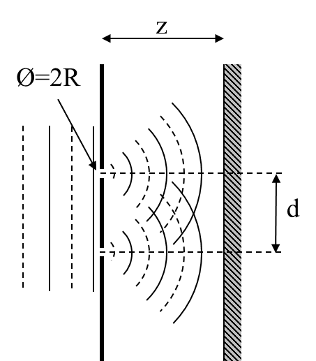

#[LightPipes for Python](http://pythonhosted.org/LightPipes/)

###Simulations of optical phenomena where diffraction is essential

[*LightPipes for Python*](http://pythonhosted.org/LightPipes/ "title" target="_blank") is a set of functions written in C++. It is designed to model coherent optical devices when the diffraction is essential. The toolbox consists of a number of functions. Each function represents an optical element or a step in the light propagation. There are apertures, intensity filters, beam-splitters, lenses and models of free space diffraction. There are also more advanced tools for manipulating the phase and amplitude of the light. The program operates on a large data structure, containing square two-dimensional arrays of complex amplitudes of the optical field of the propagating light beam.
The [*LightPipes for Python*](http://pythonhosted.org/LightPipes/) routines are modifications of the LightPipes C routines written by Gleb Vdovin for Unix, Linux, DOS and OS2 workstations.

Visit the website of ***Flexible Optical***: [http://www.okotech.com](http://www.okotech.com), where you can find the source code of *LightPipes* and a *manual*. 

[Reference to the functions](http://pythonhosted.org/LightPipes/LightPipes-methods.html)
###Example: Young interferometer

A plane wave is diffracted by two small holes, separated a distance, d. So two more or less spherical waves will propagate from these holes.

The resulting interference pattern on a screen at distance z looks like:

### The Python program, [Young.py](Examples/Interference/Young.py), described in detail.
The first step in *Python* is to import the *LightPipes for Python* library:

	
If the *LightPipes for Python* library is successful installed on your computer Python can proceed with the next step.
You probably want to plot the results, so import *matplotlib*:

I like to work with units. So define them:

We have to initiate *LightPipes for Python*. This is done with the following command:

Next we define some variables: a wavelength of 20 micrometer , a 30 x 30 mm2 square grid with 250 x 250 pixels.

Now we are ready to start the simulation. The *Begin* command generates a field with amplitude 1.0 and phase zero, a plane wave. So, all the 250 x 250 elements of array, F, contain the complex number: 1.0 + j0.0.
The next commands generate two waves, F1 and F2, which are apertured by the two circular apertures and combined (simply added) by the *BeamMix* command. The combined wavefront is propagated a distance z=30 cm by the *Fresnel* command. After that the intensity is caculated and normalized to 255 (2 -> 255, 1 -> 1.0, 0 -> not normalized) by the *Intensity* command.

The result is plotted using the fantastic *matplot* routines. We are not interested in axis around the pattern and we like to write a title above the plot.

Finally it is good practice to clean up:

###Install LightPipes for Python by opening a terminal window and type at the prompt:

LightPipes is on [PyPi](https://pypi.python.org/pypi/LightPipes/), so for Windows win32 and win64 and Macintosh OSX simply type: **(sudo) pip install LightPipes**

For LINUX '*wheels*' are [not (yet) accepted by *PyPi*](http://pythonwheels.com/), you must use *easy\_install*. (see below, *easy_install* also works for Windows and OSX) 

####[WINDOWS 32 AND 64 BIT:](LightPipes-Packages)

**pip install LightPipes**

or:

**easy_install LightPipes**

or:

**easy_install https://github.com/FredvanGoor/LightPipes-for-Python/raw/master/LightPipes-Packages/LightPipes-1.0.0-py2.7-win32.egg**

####[LINUX 64 BIT:](LightPipes-Packages)

**easy_install LightPipes**

or:

**easy\_install https://github.com/FredvanGoor/LightPipes-for-Python/raw/master/LightPipes-Packages/LightPipes-1.0.0-py2.7-linux-x86_64.egg**

####[LINUX 32 BIT:](LightPipes-Packages)

**easy_install LightPipes**

or:

**easy_install https://github.com/FredvanGoor/LightPipes-for-Python/raw/master/LightPipes-Packages/LightPipes-1.0.0-py2.7-linux-i686.egg**

####[MACINTOSH:](LightPipes-Packages)

**pip install LightPipes**

or:

**easy_install LightPipes**

or:

**easy_install https://github.com/FredvanGoor/LightPipes-for-Python/raw/master/LightPipes-Packages/LightPipes-1.0.0-py2.7-macosx-10.6-intel.egg**
